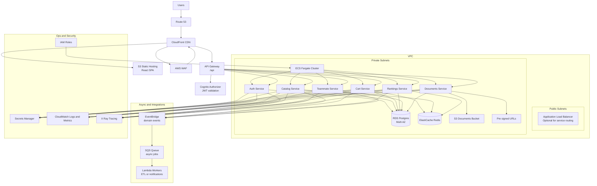

```mermaid

flowchart TB
  %% ======================
  %% Edge and Frontend
  %% ======================
  U[Users] --> R53[Route 53]
  R53 --> CF[CloudFront CDN]

  CF --> S3FE[S3 Static Hosting\nReact SPA]
  CF --> WAF[AWS WAF]

  %% ======================
  %% API Entry
  %% ======================
  CF --> APIGW[API Gateway\n/api]
  APIGW --> AUTHZ[Cognito Authorizer\nJWT validation]

  %% ======================
  %% VPC and Compute
  %% ======================
  subgraph VPC[VPC]
    direction TB

    subgraph PUB[Public Subnets]
      ALB[Application Load Balancer\nOptional for service routing]
    end

    subgraph PRIV[Private Subnets]
      ECS[ECS Fargate Cluster]

      AUTH[Auth Service]
      CATALOG[Catalog Service]
      CART[Cart Service]
      RANK[Rankings Service]
      TEAM[Teammate Service]
      FILES[Documents Service]

      ECS --> AUTH
      ECS --> CATALOG
      ECS --> CART
      ECS --> RANK
      ECS --> TEAM
      ECS --> FILES

      AUTH --> RDS[(RDS Postgres\nMulti AZ)]
      CATALOG --> RDS
      CART --> RDS
      RANK --> RDS
      TEAM --> RDS
      FILES --> RDS

      CART --> REDIS[(ElastiCache Redis)]
      CATALOG --> REDIS
      RANK --> REDIS

      FILES --> S3DOCS[S3 Documents Bucket]
      FILES --> PRESIGN[Pre signed URLs]
    end
  end

  %% API routing into services
  APIGW --> AUTH
  APIGW --> CATALOG
  APIGW --> CART
  APIGW --> RANK
  APIGW --> TEAM
  APIGW --> FILES

  %% ======================
  %% Async and Integrations
  %% ======================
  subgraph ASYNC[Async and Integrations]
    direction TB
    SQS[SQS Queue\nasync jobs]
    EB[EventBridge\ndomain events]
    LAMBDA[Lambda Workers\nETL or notifications]
  end

  CATALOG --> EB
  CART --> EB
  RANK --> EB
  TEAM --> EB
  EB --> SQS
  SQS --> LAMBDA

  %% ======================
  %% Observability and Security
  %% ======================
  subgraph OPS[Ops and Security]
    direction TB
    SM[Secrets Manager]
    CW[CloudWatch Logs and Metrics]
    XR[X Ray Tracing]
    IAM[IAM Roles]
  end

  AUTH --> SM
  CATALOG --> SM
  CART --> SM
  RANK --> SM
  TEAM --> SM
  FILES --> SM

  AUTH --> CW
  CATALOG --> CW
  CART --> CW
  RANK --> CW
  TEAM --> CW
  FILES --> CW

  AUTH --> XR
  CATALOG --> XR
  CART --> XR
  RANK --> XR
  TEAM --> XR
  FILES --> XR

  IAM --> ECS
  WAF --> CF

```