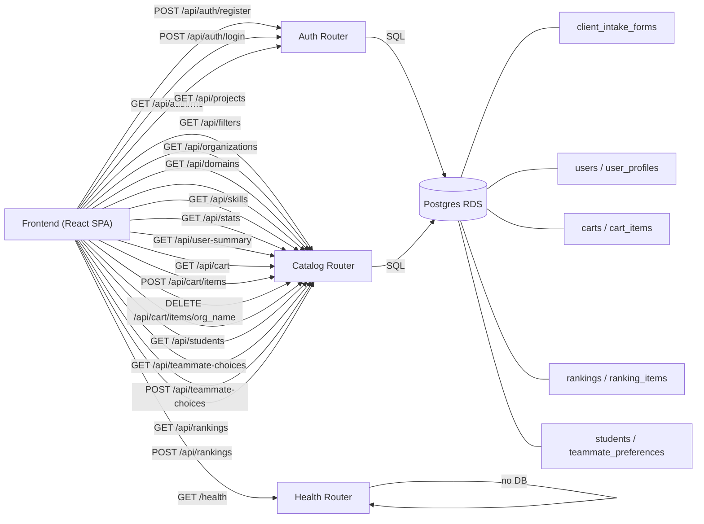

```mermaid
flowchart LR
  FE["Frontend (React SPA)"] -->|POST /api/auth/register| AUTH["Auth Router"]
  FE -->|POST /api/auth/login| AUTH
  FE -->|GET /api/auth/me| AUTH

  FE -->|GET /api/projects| CATALOG["Catalog Router"]
  FE -->|GET /api/filters| CATALOG
  FE -->|GET /api/organizations| CATALOG
  FE -->|GET /api/domains| CATALOG
  FE -->|GET /api/skills| CATALOG
  FE -->|GET /api/stats| CATALOG
  FE -->|GET /api/user-summary| CATALOG

  FE -->|GET /api/cart| CATALOG
  FE -->|POST /api/cart/items| CATALOG
  FE -->|DELETE /api/cart/items/org_name| CATALOG

  FE -->|GET /api/students| CATALOG
  FE -->|GET /api/teammate-choices| CATALOG
  FE -->|POST /api/teammate-choices| CATALOG

  FE -->|GET /api/rankings| CATALOG
  FE -->|POST /api/rankings| CATALOG

  FE -->|GET /health| HEALTH["Health Router"]

  AUTH -->|SQL| DB[("Postgres RDS")]
  CATALOG -->|SQL| DB
  HEALTH -->|no DB| HEALTH

  DB --- CIF["client_intake_forms"]
  DB --- USERS["users / user_profiles"]
  DB --- CART["carts / cart_items"]
  DB --- RANK["rankings / ranking_items"]
  DB --- TEAM["students / teammate_preferences"]
```